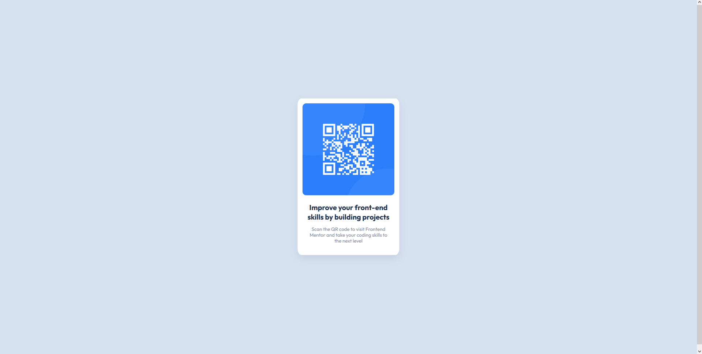

# Frontend Mentor - QR code component solution

This is a solution to the [QR code component challenge on Frontend Mentor](https://www.frontendmentor.io/challenges/qr-code-component-iux_sIO_H). Frontend Mentor challenges help you improve your coding skills by building realistic projects. 

## Table of contents

- [Overview](#overview)
  - [Screenshot](#screenshot)
  - [Links](#links)
- [My process](#my-process)
  - [Built with](#built-with)
  - [What I learned](#what-i-learned)
- [Author](#author)

## Overview

### Screenshot



### Links

- Solution URL: [https://github.com/yvma0/qr-code-component-main](https://github.com/yvma0/qr-code-component-main)
- Live Site URL: [https://yvma0.github.io/qr-code-component-main/](https://yvma0.github.io/qr-code-component-main/)

## My process

### Built with

- HTML5
- CSS
- Flexbox


### What I learned

This was mostly a good review to get back into it. I used flex and a 100vh wrapper to vertically center the card. It did make the div-nesting feel a bit excessive--I'm still trying to figure out how to limit that.


```html
<div class="wrapper">
  <div class="card">
    ...
  </div>
</div>
```
```css
.wrapper{
  min-height: 100vh; /* set height of page to viewport height, allowing for vertical centering */
  display: flex;
  justify-content: center;
  align-items: center;
}
```


## Author

- Frontend Mentor - [@yvma0](https://www.frontendmentor.io/profile/yvma0)
